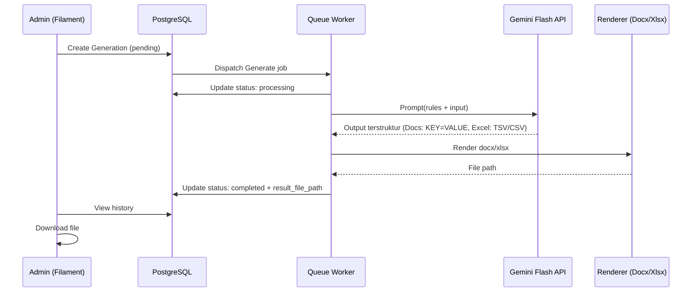

# PRD: Filament Dashboard — AI Document Generator (Gemini)

| | |
| --- | --- |
| **Tanggal** | 06 Februari 2026 |
| **Status** | Draft (menunggu koreksi) |
| **Target Pengguna** | Admin / Staff (Filament panel) |
| **Tujuan Utama** | Generate dokumen dari AI dan otomatis diekspor ke file `.docx` atau `.xlsx` sesuai template yang dipilih |

---

## 1) Ringkasan

Kita akan membangun ulang (replace total) modul **AI Document Generator** di dalam dashboard **Filament**.

Fitur inti:
- Admin mengelola **Document Template** (referensi AI) dengan tipe output: **Docs** atau **Excel**.
- Admin melakukan **Generate** berdasarkan template terpilih.
- Sistem memanggil **Gemini API** dengan model **Gemini 2.5 Flash** (`gemini-2.5-flash`).
- Hasil generate disimpan sebagai record dan **langsung diekspor otomatis** menjadi file sesuai tipe template (Docs → `.docx`, Excel → `.xlsx`).

Catatan penting: database saat ini perlu “dibersihkan” (drop/recreate tabel yang lama) karena sebelumnya ada fungsi Laravel/migrasi yang gagal.

---

## 2) Asumsi & Interpretasi

Karena ada frasa “langsung ke docs”, PRD ini mengasumsikan:
- “Docs” = file **Word `.docx`** (bukan Google Docs cloud).

Kalau yang dimaksud “Google Docs” (Drive API), itu bisa jadi fase berikutnya (lihat bagian *Out of Scope / Future*).

---

## 3) Ruang Lingkup

### In Scope (wajib)
- Filament UI untuk:
    - CRUD **Template Dokumen**.
    - Membuat permintaan generate dan melihat histori.
    - Download file hasil.
- Integrasi Gemini API:
    - Model: **Gemini 2.5 Flash** (ditentukan via env `GEMINI_MODEL=gemini-2.5-flash`).
    - Prompt berbasis tipe output (docs/excel) + input user.
- Storage hasil ekspor:
    - `.docx` untuk Docs.
    - `.xlsx` untuk Excel.
- Database PostgreSQL: **2 tabel** (template & hasil generate).
- Proses generate **async** via queue supaya UI Filament tidak nge-freeze.

### Out of Scope (tidak dikerjakan di fase ini)
- Integrasi Google Drive/Google Docs API (publish ke Google Docs online).
- Multi-tenant / multi-organization.
- Marketplace template publik.
- Approval workflow berlapis.

---

## 4) Pengguna & Hak Akses

### Role
- **Admin**: full akses (manage template, generate, download, delete).
- **Staff** (opsional, tergantung kebutuhan): boleh generate & download, tidak boleh delete template.

Kontrol akses via policy/gate Laravel + Filament shield (opsional).

---

## 5) User Journey (End-to-End)

1) Admin membuat Template
- Pilih tipe: **Docs** atau **Excel**
- Upload file template sesuai tipe:
    - `docs` → template `.docx`
    - `excel` → template `.xlsx`
- Simpan

2) Admin Generate dokumen
- Pilih template
- Isi prompt (instruksi dokumen) — hanya untuk proses generate, tidak disimpan ke database
- (Opsional) upload file sumber yang ingin diubah (pdf/docx/xlsx)
- Submit → status `pending`

3) Sistem memproses
- Queue worker mengambil job
- Call Gemini (gemini-2.5-flash)
- Validasi format output
- Render ke `.docx`/`.xlsx`
- Simpan file + update status `completed`

4) Admin download
- Dari tabel histori, klik Download

---

## 6) Alur Sistem (Sequence)



---

## 7) Data Model (PostgreSQL)

### 7.1 Tabel 1 — `document_templates`

Tujuan: menyimpan template yang menjadi referensi AI.

| Kolom | Tipe | Catatan |
|---|---|---|
| `id` | UUID / BIGINT | PK |
| `name` | varchar(150) | Nama template |
| `description` | text nullable | Deskripsi singkat |
| `output_type` | enum | `docs` atau `excel` |
| `template_path` | varchar(500) | Path file template (`.docx`/`.xlsx`) |
| `created_at` | timestamp | |
| `updated_at` | timestamp | |

Index minimal:
- `output_type`

### 7.2 Tabel 2 — `generated_documents`

Tujuan: menyimpan request generate + hasil + metadata ekspor.

| Kolom | Tipe | Catatan |
|---|---|---|
| `id` | UUID / BIGINT | PK |
| `user_id` | fk users | Requester |
| `document_template_id` | fk document_templates | Template terpilih |
| `source_file_path` | varchar(500) nullable | File sumber yang diupload untuk diubah (pdf/docx/xlsx), opsional |
| `status` | enum | `pending`, `processing`, `completed`, `failed` |
| `result_file_path` | varchar(500) nullable | Path hasil export (.docx/.xlsx) |
| `error_message` | text nullable | Detail error |
| `created_at` | timestamp | |
| `updated_at` | timestamp | |

Index minimal:
- (`status`, `created_at`)
- (`document_template_id`, `created_at`)

---

## 8) Spesifikasi Output & Kontrak Data

Target utama fase ini adalah hemat token, jadi kontrak output **tidak menggunakan JSON**.

### 8.1 Strategi Generasi Dokumen (Dynamic Rebuilding)
Sistem tidak lagi menggunakan placeholder statis `${key}`. Sebagai gantinya, sistem melakukan:
1. **Analisis Struktur**: Membaca elemen-elemen dokumen (Paragraf, Tabel, List) dari file template.
2. **Contextual Prompting**: Mengirimkan struktur dokumen tersebut ke AI agar AI memahami layout yang diinginkan.
3. **Penyusunan Ulang**: AI mengembalikan konten untuk setiap bagian (`BAGIAN 1`, `BAGIAN 2`, dst) dan setiap tabel (`TABEL 1`).
4. **Rekonstruksi**: Sistem membangun dokumen baru dengan gaya (style) yang mewarisi dari template asli namun dengan konten baru dari AI.

Aturan Output AI:
- Dokumen dibagi menjadi blok-blok bertanda `BAGIAN n:`.
- Tabel menggunakan format TSV di bawah tanda `TABEL n:`.
- Tanpa penjelasan tambahan, langsung ke konten.

### 8.2 Ekstraksi File Sumber (Source File Extraction)
Jika user mengupload file sumber (`pdf`, `docx`, `xlsx`, `txt`), sistem akan:
- Mengekstrak teks mentah dari file tersebut.
- Menyertakannya dalam prompt sebagai referensi utama bagi AI untuk menghasilkan konten yang akurat.

---

## 9) Prompting & Safety

### Prompt template (high-level)
Sistem akan membangun prompt dari komponen:
- System instruction (aturan output, tanpa markdown)
- Input user: prompt dari form generate (tidak disimpan ke DB)
- (Opsional) ringkasan hasil ekstraksi dari `source_file_path` (dibuat oleh backend untuk menghemat token)

Catatan:
- File template disimpan untuk kebutuhan **rendering** (layout/style/struktur dokumen), bukan untuk disisipkan ke prompt.

Aturan wajib:
- Output harus mengikuti kontrak di bagian 8 (Docs = `BAGIAN n:`, Excel = TSV).
- Jangan pakai markdown fence (```), jangan ada pembuka/penutup.
- AI harus menghasilkan teks mentah yang terstruktur sesuai label yang diberikan.

### Mitigasi prompt injection
- Anggap `input_payload` sebagai data, bukan instruksi utama.
- System message menegaskan bahwa aturan output tidak boleh diabaikan.
- Validasi output strict; jika format tidak sesuai kontrak (misal label BAGIAN hilang) → `failed`.

---

## 10) Filament UI (Konsep)

### 10.1 Resource: Templates
- List: name, output_type badge, template_path, updated_at
- Form:
    - name
    - description
    - output_type (docs/excel)
    - upload template file (validasi ekstensi: `docs`→`.docx`, `excel`→`.xlsx`)

### 10.2 Resource: Generated Documents (History)
- List: template, status badge, created_at, updated_at
- Actions:
    - **Generate** (Create): pilih template + isi prompt + (opsional) upload file sumber
    - **Download**: hanya ketika `completed`
- Detail page: tampilkan error_message (read-only) untuk debugging

---

## 11) Background Processing (Queue)

Wajib async.

Job utama: `GenerateDocumentJob`
- Input: `generated_documents.id`
- Steps:
    1) set `processing`
    2) jika ada `source_file_path`, lakukan ekstraksi ringkas (tanpa mengirim file mentah ke AI)
    3) call Gemini (`gemini-2.5-flash`)
    4) parse & validate output (Docs: `KEY=VALUE`, Excel: TSV/CSV)
    5) render file sesuai `document_templates.output_type`
    5) simpan ke storage, update `result_file_path`, `completed`
    6) kirim Filament notification

Retry policy (usulan):
- tries: 3
- backoff: 10s, 30s, 60s

---

## 12) Konfigurasi Environment

Database (sesuai yang kamu kasih):
```ini
DB_CONNECTION=pgsql
DB_HOST=localhost
DB_PORT=5432
DB_DATABASE=filamentLlm
DB_USERNAME=postgres
DB_PASSWORD=admin0123
```

Gemini (nama env disepakati di implementasi):
```ini
GEMINI_API_KEY=...
GEMINI_MODEL=gemini-2.5-flash
```

Storage:
```ini
FILESYSTEM_DISK=public
```

Queue:
```ini
QUEUE_CONNECTION=database
```

---

## 13) Kriteria Sukses (Acceptance Criteria)

Wajib terpenuhi:
- Admin dapat membuat template Docs dan Excel.
- Generate menggunakan template Docs menghasilkan file `.docx` yang bisa didownload.
- Generate menggunakan template Excel menghasilkan file `.xlsx` yang bisa didownload.
- Record histori tersimpan dengan status yang benar (`pending/processing/completed/failed`).
- Jika Gemini mengembalikan output tidak sesuai kontrak (KEY=VALUE atau TSV/CSV) → status `failed` + error_message terisi.

