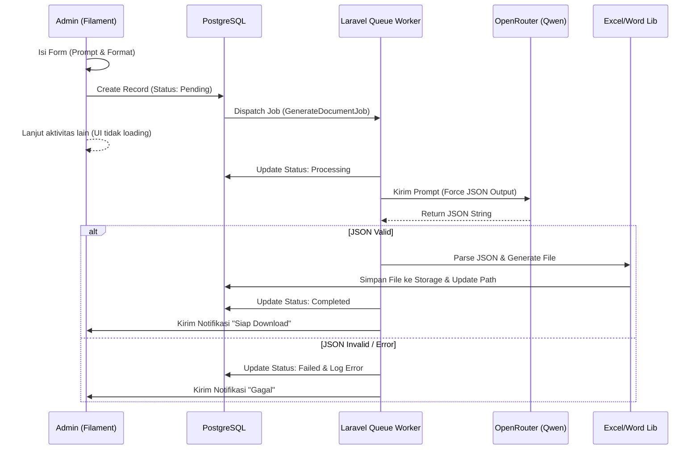

# Product Requirements Document (PRD): Sistem Generator Dokumen AI

| | |
| --- | --- |
| **Tanggal** | 02 Februari 2026 |
| **Status** | Draft / Ready for Dev |
| **Target Pengguna** | Admin / Staff Operasional |

---

## 1. Ringkasan Eksekutif

Sistem ini adalah modul tambahan pada panel Admin **Filament** yang memungkinkan pengguna menghasilkan dokumen bisnis terstruktur (Laporan Excel & Dokumen Word) secara otomatis menggunakan AI (LLM). Sistem ini menggunakan pendekatan *asynchronous* (antrian) untuk menangani latensi LLM dan memanfaatkan model gratis dari **OpenRouter (Qwen)** untuk efisiensi biaya.

## 2. Spesifikasi Teknologi (Tech Stack)

Berikut adalah teknologi yang wajib diinstal dan dikonfigurasi.

### Core Backend
- **Framework**: Laravel 12.x
- **Database**: PostgreSQL 16+ (Wajib menggunakan tipe data `JSONB` untuk log AI).
- **PHP**: Versi 8.3 / 8.4
- **Queue Driver**: Redis (Production) atau Database (Development). Wajib ada karena proses AI memakan waktu 30-60 detik.

### Admin Panel
- **FilamentPHP v3.x**: Untuk UI/UX utama.
- **Filament Notifications**: Untuk memberitahu user saat file selesai dibuat.

### AI Integration
- **Provider**: OpenRouter.ai
- **Model**: `qwen/qwen3-next-80b-a3b-instruct:free` (Gratis, High Performance).
- **Library**: `openai-php/laravel` (Client standar).

### Document Processing
- **Excel**: `maatwebsite/excel` (Laravel Excel).
- **Word**: `phpoffice/phpword` (Untuk manipulasi template `.docx`).

## 3. Alur Kerja Sistem (Flowchart)



## 4. Skema Database

Dibutuhkan satu tabel utama untuk melacak status permintaan. PostgreSQL sangat disarankan karena kolom `ai_response_log` akan menyimpan struktur JSON yang kompleks.

**Table Name: `ai_document_requests`**

| Column Name | Type | Keterangan |
|---|---|---|
| `id` | UUID | Primary Key |
| `user_id` | Foreign ID | User yang me-request |
| `topic` | Varchar(255) | Judul dokumen untuk referensi |
| `user_prompt` | Text | Instruksi asli dari user |
| `target_format` | Enum | `excel`, `word` |
| `status` | Enum | `pending`, `processing`, `completed`, `failed` |
| `file_path` | Varchar(500) | Lokasi file di `storage/app/public` (Nullable) |
| `ai_response_log` | JSONB | Menyimpan respon mentah dari AI untuk debugging |
| `error_message` | Text | Pesan error jika gagal (Nullable) |
| `created_at` | Timestamp | |
| `updated_at` | Timestamp | |

## 5. Strategi Implementasi (Step-by-Step)

### A. Konfigurasi Environment (`.env`)

Pastikan konfigurasi mengarah ke OpenRouter namun menggunakan driver OpenAI agar kompatibel dengan library.

```ini
DB_CONNECTION=pgsql
QUEUE_CONNECTION=database # Ubah ke redis saat production

# OpenRouter Config (Spoofing OpenAI)
OPENAI_API_KEY=sk-or-v1-xxxxxxxxxxxxxxxxxxxx
OPENAI_BASE_URI=https://openrouter.ai/api/v1
```

### B. Prompt Engineering Strategy

Ini adalah kunci keberhasilan. Kita harus memaksa output dari AI berupa JSON.

> **System Prompt Template:**
>
> "Anda adalah Data Generator Engine. Tugas Anda HANYA menghasilkan output data mentah dalam format JSON Array berdasarkan permintaan user.
>
> JANGAN gunakan markdown formatting (seperti ```json).
>
> JANGAN berikan teks pembuka atau penutup.
>
> Pastikan JSON valid RFC 8259.
>
> Jika diminta Excel, buat array of objects.
>
> Jika diminta Word, buat object key-value."

### C. Technical Code Snippets

#### 1. Migration (PostgreSQL)

```php
// database/migrations/xxxx_create_ai_document_requests_table.php
public function up(): void
{
    Schema::create('ai_document_requests', function (Blueprint $table) {
        $table->uuid('id')->primary();
        $table->foreignId('user_id')->constrained();
        $table->string('topic');
        $table->text('user_prompt');
        $table->enum('target_format', ['excel', 'word']);
        $table->enum('status', ['pending', 'processing', 'completed', 'failed'])->default('pending');
        $table->string('file_path')->nullable();
        $table->jsonb('ai_response_log')->nullable(); // PostgreSQL JSONB
        $table->text('error_message')->nullable();
        $table->timestamps();
    });
}
```

#### 2. The Job Logic (`GenerateAiDocument.php`)

```php
namespace App\Jobs;

use App\Models\AiDocumentRequest;
use Illuminate\Bus\Queueable;
use Illuminate\Contracts\Queue\ShouldQueue;
use Illuminate\Foundation\Bus\Dispatchable;
use Illuminate\Queue\InteractsWithQueue;
use Illuminate\Queue\SerializesModels;
use OpenAI\Laravel\Facades\OpenAI;
use Filament\Notifications\Notification;
use Maatwebsite\Excel\Facades\Excel;
use App\Exports\DynamicAiExport; // Custom Export Class

class GenerateAiDocument implements ShouldQueue
{
    use Dispatchable, InteractsWithQueue, Queueable, SerializesModels;

    public $timeout = 120; // 2 Menit timeout (AI bisa lama)

    public function __construct(public AiDocumentRequest $request) {}

    public function handle(): void
    {
        $this->request->update(['status' => 'processing']);

        try {
            // 1. Panggil OpenRouter
            $response = OpenAI::chat()->create([
                'model' => 'qwen/qwen3-next-80b-a3b-instruct:free',
                'messages' => [
                    ['role' => 'system', 'content' => 'OUTPUT ONLY JSON. NO MARKDOWN. NO CONVERSATION.'],
                    ['role' => 'user', 'content' => $this->request->user_prompt],
                ],
                // Header wajib untuk OpenRouter
                'extra_headers' => [
                    'HTTP-Referer' => config('app.url'),
                    'X-Title' => config('app.name'),
                ]
            ]);

            $rawContent = $response->choices[0]->message->content;
            
            // 2. Bersihkan Markdown (Sanitasi)
            $cleanJson = str_replace(['```json', '```', 'json'], '', $rawContent);
            $data = json_decode($cleanJson, true);

            if (!$data) {
                throw new \Exception("Gagal parsing JSON dari AI.");
            }

            // 3. Simpan Log untuk Debugging
            $this->request->update(['ai_response_log' => $data]);

            // 4. Generate File (Contoh Excel)
            $fileName = 'ai-docs/' . $this->request->id . '.' . ($this->request->target_format === 'excel' ? 'xlsx' : 'docx');
            
            if ($this->request->target_format === 'excel') {
                Excel::store(new DynamicAiExport($data), $fileName, 'public');
            } else {
                // Logika PHPWord disini
                // $phpWord->save(storage_path(...));
            }

            // 5. Finalisasi
            $this->request->update([
                'status' => 'completed',
                'file_path' => $fileName
            ]);

            // 6. Notifikasi ke User via Filament
            Notification::make()
                ->title('Dokumen Siap')
                ->body("Dokumen {$this->request->topic} berhasil dibuat.")
                ->success()
                ->sendToDatabase($this->request->user);

        } catch (\Exception $e) {
            $this->request->update([
                'status' => 'failed',
                'error_message' => $e->getMessage()
            ]);
            
            // Retry logic manual jika diperlukan
        }
    }
}
```

#### 3. Filament Resource (`AiDocumentRequestResource.php`)

Halaman untuk melihat riwayat dan membuat request baru.

- **CreateAction**: Jangan jalankan logika AI di sini. Cukup buat data di database, lalu panggil `GenerateAiDocument::dispatch($record)`.

- **Table**: Tampilkan kolom status dengan `BadgeColumn`.
    - `pending` (Abu-abu)
    - `processing` (Kuning + `animate-pulse`)
    - `completed` (Hijau)
    - `failed` (Merah)

- **Action Download**: Hanya muncul jika `status === 'completed'`. Menggunakan `Storage::download($record->file_path)`.

## 6. Penanganan Error & Batasan (Mitigasi)

### Model Halusinasi
- **Masalah**: AI kadang mengembalikan teks biasa walaupun diminta JSON.
- **Solusi**: Gunakan fungsi PHP `json_decode()` di dalam blok `try-catch`. Jika gagal, tandai status sebagai `failed` di database agar user tahu dan bisa mencoba prompt yang lebih spesifik.

### Rate Limit OpenRouter Free
- **Masalah**: Model Qwen versi gratis kadang sibuk (Error 429/503).
- **Solusi**: Gunakan fitur `tries` dan `backoff` pada Laravel Job.

```php
public $tries = 3; // Coba 3 kali
public $backoff = [10, 30, 60]; // Tunggu 10dtk, 30dtk, 60dtk sebelum coba lagi
```
